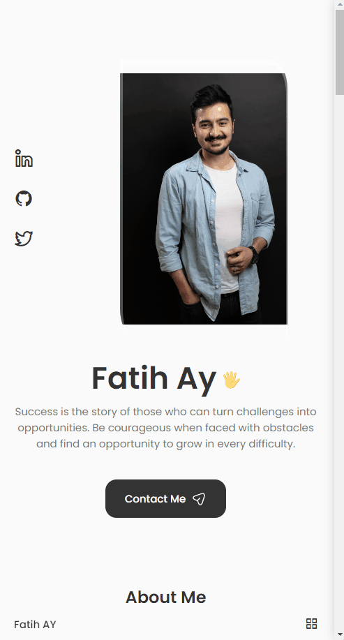

# Blog App
## Live Link: https://portfolio-fay-react.netlify.app/
## Description
This is my Portfolio Page. Thanks for being here! 🙂

```
.
├── README.md
├── package-lock.json
├── package.json
├── public
│   ├── favicon-16x16.png
│   └── index.html
└── src
    ├── App.css
    ├── App.js
    ├── assets
    │   └── [your files...]
    ├── components
    │   ├── about
    │   │   ├── About.jsx
    │   │   ├── Info.jsx
    │   │   └── about.css
    │   ├── contact
    │   │   ├── Contact.jsx
    │   │   └── contact.css
    │   ├── footer
    │   │   ├── Footer.jsx
    │   │   └── footer.css
    │   ├── header
    │   │   ├── Header.jsx
    │   │   └── header.css
    │   ├── home
    │   │   ├── Data.jsx
    │   │   ├── Home.jsx
    │   │   ├── ScrollDown.jsx
    │   │   ├── Social.jsx
    │   │   └── home.css
    │   ├── qualification
    │   │   ├── Qualification.jsx
    │   │   └── qualification.css
    │   ├── scrollup
    │   │   ├── ScrollUp.jsx
    │   │   └── scrollup.css
    │   ├── skills
    │   │   ├── Backend.jsx
    │   │   ├── Frontend.jsx
    │   │   ├── Skills.jsx
    │   │   └── skills.css
    │   └── work
    │       └── [your works...]
    └── index.js

```

## Example Outcomes
<div >


</div>

## Getting Started

To run the application on your local machine, follow these steps:

1. Clone the project to your computer:

   ```
   git clone https://github.com/iamfatihay/Portfolio.git
2. Open your terminal and navigate to the project directory.
   ```
   cd portfolio
3. Install the dependencies:
    ```
    npm install
4. Start the application:
    ```
    npm start
5. Open your web browser and visit  **http://localhost:3000**  to explore the Blog Application.
