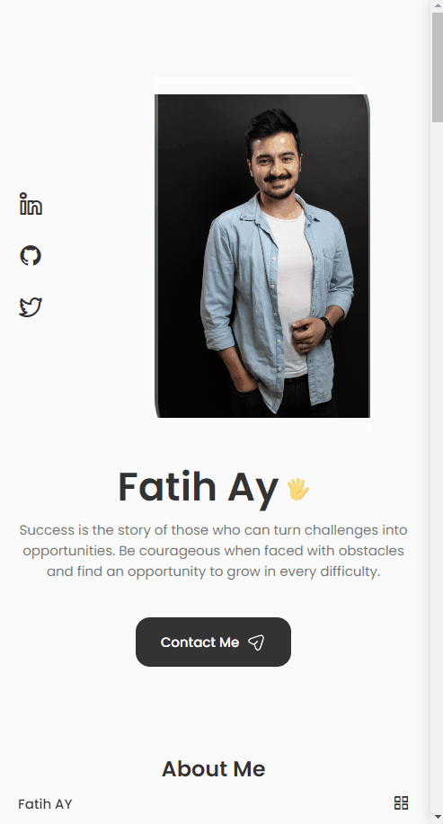

# Portfolio Page
## Live Link: https://portfolio-fay-react.netlify.app/
## Description
This is my Portfolio Page. Thanks for being here! 🙂

```
.
├── README.md
├── package-lock.json
├── package.json
├── public
│   ├── favicon-16x16.png
│   └── index.html
└── src
    ├── App.css
    ├── App.js
    ├── assets
    │   └── [your files...]
    ├── components
    │   ├── about
    │   │   ├── About.jsx
    │   │   ├── Info.jsx
    │   │   └── about.css
    │   ├── contact
    │   │   ├── Contact.jsx
    │   │   └── contact.css
    │   ├── footer
    │   │   ├── Footer.jsx
    │   │   └── footer.css
    │   ├── header
    │   │   ├── Header.jsx
    │   │   └── header.css
    │   ├── home
    │   │   ├── Data.jsx
    │   │   ├── Home.jsx
    │   │   ├── ScrollDown.jsx
    │   │   ├── Social.jsx
    │   │   └── home.css
    │   ├── qualification
    │   │   ├── Qualification.jsx
    │   │   └── qualification.css
    │   ├── scrollup
    │   │   ├── ScrollUp.jsx
    │   │   └── scrollup.css
    │   ├── skills
    │   │   ├── Backend.jsx
    │   │   ├── Frontend.jsx
    │   │   ├── Skills.jsx
    │   │   └── skills.css
    │   └── work
    │       └── [your works...]
    ├── helper
    │       └── ToastNotify.tsx
    └── index.js

```

## Example Outcomes
<div >


</div>

## Getting Started

To run the application on your local machine, follow these steps:

1. Clone the project to your computer:

   ```
   git clone https://github.com/iamfatihay/Portfolio.git
2. Open your terminal and navigate to the project directory.
   ```
   cd portfolio
3. Install the dependencies:
    ```
    npm install
4. **Configure EmailJS (Optional):** To enable the contact form functionality:
    - Sign up for a free account at [EmailJS](https://www.emailjs.com/)
    - Create an email service and template
    - Copy `.env.example` to `.env`:
      ```
      cp .env.example .env
      ```
    - Update the `.env` file with your EmailJS credentials:
      ```
      REACT_APP_EMAILJS_SERVICE_ID=your_actual_service_id
      REACT_APP_EMAILJS_TEMPLATE_ID=your_actual_template_id
      REACT_APP_EMAILJS_PUBLIC_KEY=your_actual_public_key
      ```
    - **Note:** The contact form will still display without EmailJS configuration, but will show a friendly message directing users to use email or WhatsApp instead.

5. Start the application:
    ```
    npm start
6. Open your web browser and visit  **http://localhost:3000**  to explore the Application.
